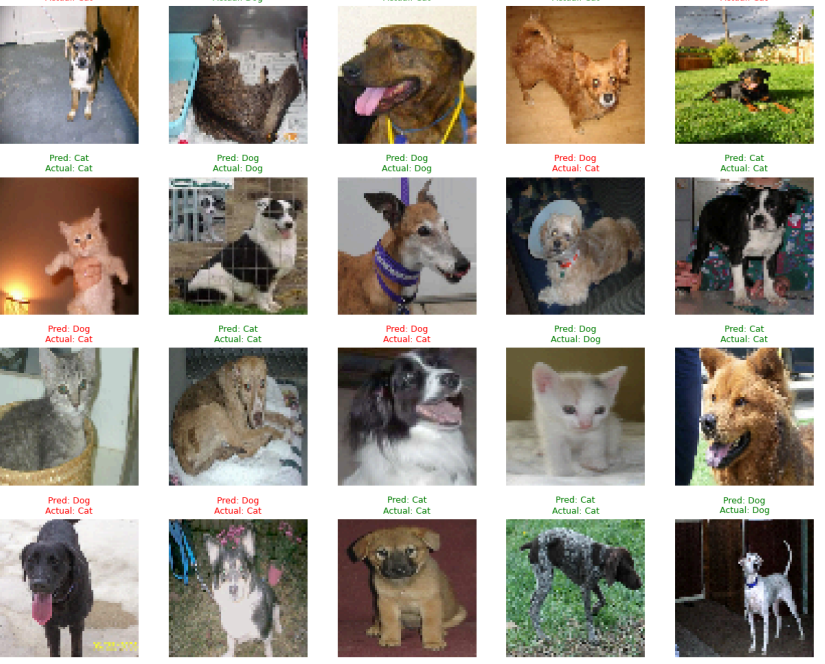

# 🐱🐶 Cat vs Dog Image Classification using SVM + HOG

This project is part of my internship with [SkillCraft Technology](https://www.linkedin.com/company/skillcraft-technology/), where I built an image classifier to distinguish between cats and dogs using classical Machine Learning techniques.

The model uses **Support Vector Machine (SVM)** with features extracted from images using **Histogram of Oriented Gradients (HOG)**.

---

## 🔧 Technologies Used

- Python
- OpenCV
- scikit-learn
- NumPy
- Matplotlib
- HOG (from skimage)

---

## 🧠 Project Highlights

- Preprocessed image data (resized to 64x64)
- Extracted HOG features for each image
- Built and trained an SVM classifier with RBF kernel
- Achieved ~72% accuracy on unseen test data
- Visualized predictions in a grid with actual vs predicted labels

---

## 📁 Dataset

You can download the dataset used in this project from the link below:

👉 **[Download Dataset](https://www.kaggle.com/datasets/shaunthesheep/microsoft-catsvsdogs-dataset)**

The original PetImages dataset was very large, so for this project, I created a filtered version by selecting:

- **1000 Cat images**
- **1000 Dog images**

These were resized and stored in a separate ZIP file for training and testing the model.

👉 **[Download Filtered Dataset](https://drive.google.com/file/d/1dka24GNfx-S-kmUcAFfnn3CmYUNc6yh5/view?usp=sharing)**

> _(This is a reduced and sorted version of the original dataset, compressed into a single ZIP file containing the selected images.)_

---

## 📊 Sample Output

Below is a sample of how predictions are visualized:

---

## 💡 How to Run

1. Clone this repo
2. Upload or unzip `dataset_images.zip` in the working directory
3. Run `cat_dog_classifier.ipynb` in Google Colab or Jupyter Notebook

---

## 🙌 Credits

- Dataset inspired by Microsoft PetImages (used a filtered subset)
- Internship provided by [SkillCraft Technology](https://www.linkedin.com/company/skillcraft-technology/)
